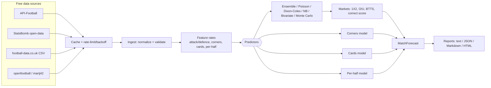
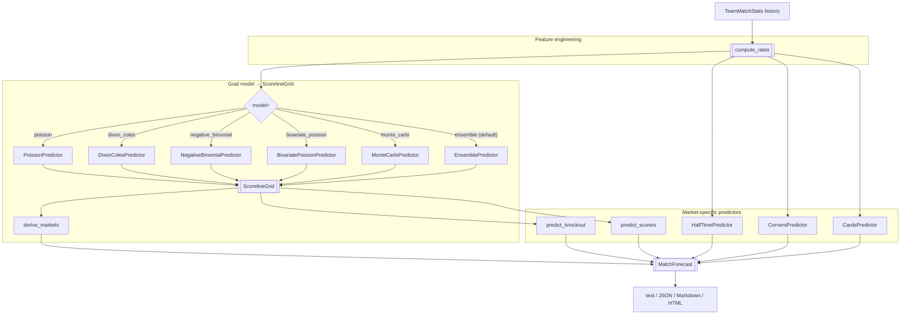

# soccer-prediction

Forecast soccer matches — with the **FIFA World Cup 2026** as the headline use case — from **free** historical stats. Given two teams, it predicts full-time and per-half scorelines, **total and minimum corners**, cards, both-teams-to-score, and over/under totals, and can render the result as text, JSON, Markdown, or a styled HTML report.

- Pure-Python core (no heavy runtime dependencies); optional `[accel]` extra for numpy/scipy/penaltyblog.
- Pluggable free data sources (API-Football, StatsBomb open-data, football-data.co.uk, openfootball) behind one `DataSource` contract.
- Six interchangeable goal models, including a robust ensemble and reproducible random-scenario simulation, plus dedicated corner, card, and per-half models.
- Library API + `soccer-predict` CLI + runnable offline examples.

## Table of Contents

- [Overview](#overview)
- [System Architecture](#system-architecture)
- [Prediction Pipeline](#prediction-pipeline)
- [Package Layout](#package-layout)
- [Getting Started](#getting-started)
- [Quick Start](#quick-start)
- [Example: Switzerland vs Colombia](#example-switzerland-vs-colombia)
- [CLI Reference](#cli-reference)
- [Public API Reference](#public-api-reference)
- [Data Sources](#data-sources)
- [Prediction Models](#prediction-models)
- [Prediction Packages](#prediction-packages)
- [Configuration](#configuration)
- [Logging and Security](#logging-and-security)
- [Testing and Quality Gates](#testing-and-quality-gates)
- [Version History](#version-history)
- [Packaging and Release](#packaging-and-release)
- [License](#license)

## Overview

Key features:

- ⚽ **Full-time result** (1X2), correct-score grid, over/under, and both-teams-to-score, all derived consistently from one scoreline distribution.
- ⏱️ **Per-half scoring** — separate first- and second-half models for "who scores in each half".
- 🚩 **Corners** — expected and total corners, over/under lines, and a **minimum** (10th-percentile) estimate per team.
- 🟨 **Cards** — yellow/red expectations, booking points, and over/under card lines.
- 🥅 **Goalscorers & assists** — separate score/assist probabilities, combined and first-scorer markets, compact row bars, and an all-player recent-scoring comparison chart with an explicit aggregate-data fallback.
- 🏆 **Extra time & penalties** — knockout advancement probability with an extra-time model and an analytical best-of-five-plus-sudden-death shootout.
- 🔌 **Free data** — swap data sources without touching the models; bundled offline samples for zero-setup demos.
- 🧪 **Trustworthy** — walk-forward backtesting with ranked-probability-score, log-loss, and Brier metrics.
- 🎲 **Uncertainty-aware** — all-model comparisons, approximate 80% sensitivity ranges, simulated goal ranges, and high-scoring or one-sided tail scenarios.
- 🧠 **Momentum-aware** — recent wins/losses, margins, and streaks feed a short-lived, capped morale proxy displayed alongside recent form.
- 🕸️ **Opponent-aware** — recent form, direct meetings, and bounded multi-opponent paths adjust for strength of schedule instead of treating every opponent as equal.

## System Architecture



## Prediction Pipeline

Every forecast runs through the same algorithm chain regardless of data source. All of it — the goal-rate model, the corner/card count models, the knockout shootout model, and the goalscorer attribution — is computed here, in pure Python; nothing is delegated to an external statistics package.



| Stage | Algorithm | Implementation |
| --- | --- | --- |
| Feature engineering | Recency weighting, shrinkage, head-to-head blending, opponent-network adjustment, and bounded morale/momentum | `soccer_prediction/features/` |
| Goal model (`poisson`) | Independent-Poisson outer product over home/away goal expectations | `soccer_prediction/predictors/poisson.py` |
| Goal model (`dixon_coles`) | Poisson grid with a history-adaptive low-score draw correction | `soccer_prediction/predictors/dixon_coles.py` |
| Goal model (`negative_binomial`) | Overdispersed goal counts with history-fitted dispersion and heavier tails | `soccer_prediction/predictors/negative_binomial.py` |
| Goal model (`bivariate_poisson`) | Shared tempo process introduces within-match scoring correlation | `soccer_prediction/predictors/bivariate_poisson.py` |
| Goal model (`monte_carlo`) | Reproducible cagey/open/momentum state simulations with tempo shocks | `soccer_prediction/predictors/monte_carlo.py` |
| Goal model (`ensemble`, default) | Regularized probability pool of four complementary families, with a recent temporal holdout when enough history exists | `soccer_prediction/predictors/ensemble.py` |
| Robustness analysis | Six-row model comparison, per-model sensitivity ranges, agreement, entropy, simulated ranges and tail events | `soccer_prediction/predictors/analysis.py` |
| Match context | Recent form, direct meetings, A–D–F–Z-style graph paths, and inferred game style | `soccer_prediction/features/context.py` |
| Market derivation | 1X2/over-under/BTTS/correct-score read directly off the scoreline grid — mutually consistent by construction | `soccer_prediction/predictors/markets.py::derive_markets` |
| Per-half | Two independent Poisson models (first-half rate from HT goals, second-half rate from FT-minus-HT goals) | `soccer_prediction/predictors/half_time.py` |
| Corners | Count model on corner-for/against rates; league-average prior fallback when the source has no corner data; minimum = 10th-percentile floor of the fitted distribution | `soccer_prediction/predictors/corners.py` |
| Cards | Poisson count model with a home-advantage discount and an optional referee-strictness multiplier | `soccer_prediction/predictors/cards.py` |
| Knockout (extra time + penalties) | Fatigue-scaled extra-time Poisson, then an analytical best-of-five-plus-sudden-death shootout from each side's penalty-conversion rate | `soccer_prediction/predictors/knockout.py` |
| Goalscorers/assists | Team expected-goals split across the squad by historical goal/assist share | `soccer_prediction/predictors/scorers.py` |
| Backtesting | Walk-forward validation (train strictly before each test match) scored with RPS, log-loss, Brier | `soccer_prediction/calibration/backtest.py`, `metrics.py` |

See [Prediction Packages](#prediction-packages) below for exactly which libraries back each stage, and [docs/models.md](docs/models.md) for the statistical detail and known limitations of each model.

## Package Layout

```text
soccer_prediction/
  __init__.py        # top-level facade: forecast_fixture, predict_match, __version__
  __main__.py         # `python -m soccer_prediction` entry point
  public.py            # forecast_fixture / predict_match orchestration
  version.py             # installed-metadata version lookup
  datasources/            # DataSource protocol + adapters (API-Football, StatsBomb, football-data.co.uk, openfootball, martj42) + cache
  ingest/                  # record normalization and validation
  features/                 # team rate computation (recency-weighted, shrunk)
  predictors/                 # Goal ensembles/simulations + corners/cards/half-time/knockout/scorers models
  models/                        # typed dataclasses: matches, teams, players, predictions
  calibration/                     # walk-forward backtesting + RPS/log-loss/Brier metrics
  cli/                                # Typer app: predict, fetch, backtest
  config/                              # AppConfig loader + defaults.yaml
  reporting/                             # text/JSON/Markdown/HTML forecast renderers
  example/                                 # offline worked examples + bundled sample data
tests/                                       # pytest suite (one module per adapter/predictor/surface)
docs/                                          # api.md, data-sources.md, models.md
```

Everything under `soccer_prediction/` is importable; `tests/` and `docs/` are developer- and reader-facing only.

## Getting Started

Requires Python 3.11+, cross-platform (Windows, macOS, Linux).

```powershell
py -m venv .venv
.\.venv\Scripts\Activate.ps1
python -m pip install --upgrade pip
python -m pip install -e ".[dev]"
```

```bash
python3 -m venv .venv
. .venv/bin/activate
python -m pip install --upgrade pip
python -m pip install -e ".[dev]"
```

The heavy scientific stack is optional; install it only if you want to plug in numpy/scipy/penaltyblog-backed models:

```bash
python -m pip install -e ".[accel]"
```

## Quick Start

```python
from soccer_prediction import forecast_fixture

forecast = forecast_fixture("Brazil", "Argentina", source="bundled_wc2026")
print(forecast.result.selection, f"{forecast.result.probability:.1%}")
print("Total corners:", round(forecast.corners.total_expected, 2))
print("Minimum corners:", forecast.corners.home_minimum, "-", forecast.corners.away_minimum)
```

Run the bundled World Cup 2026 example:

```bash
python -m soccer_prediction
```

## Example: Switzerland vs Colombia

The `soccer_prediction.example` package ships offline, illustrative history for both national teams and forecasts the fixture end to end, writing an HTML and a Markdown report.

```python
from soccer_prediction.example import run_switzerland_colombia, write_reports, build_forecast

# Print a text forecast and write reports/switzerland_colombia_<timestamp>.{html,md}
run_switzerland_colombia()

# Or get the typed forecast and inspect any market
forecast = build_forecast()
print(forecast.correct_score.home_draw_away())      # (home, draw, away)
print(forecast.corners.home_minimum, forecast.corners.away_minimum)
print(forecast.per_half.half_time_result)

# Write reports to a directory of your choice
paths = write_reports("my_reports")
print(paths["html"], paths["md"])
```

From a clean checkout (no install needed):

```bash
python -c "from soccer_prediction.example.fixture_example import run_example; run_example()"
```

Or straight from the CLI, writing a styled HTML report:

```bash
soccer-predict predict --home Switzerland --away Colombia --source bundled_swi_col --format html --output reports/switzerland_colombia.html
```

The bundled history is illustrative sample data for offline demos. In production the same models run on real data pulled from the free sources below.

### Other competing team pairs

`soccer_prediction/example/fixture_example.py` defines every runnable pair in one constant registry, `FIXTURES: dict[str, FixtureSpec]`, so adding a new fixture never duplicates the loading/registration code:

```python
from soccer_prediction.example.fixture_example import FIXTURES, build_forecast, run_example

print(list(FIXTURES))   # ['switzerland_colombia', 'france_morocco', 'argentina_egypt']

# Any registered fixture works the same way, selected by key:
run_example(key="france_morocco")
run_example(key="argentina_egypt")
forecast = build_forecast(key="argentina_egypt", live=False)   # offline, bundled sample
```

Each entry in `FIXTURES` owns its own bundled sample data and its own registered data-source names, so fixtures never collide with one another.

### Real World Cup 2026 results

The `worldcup_2026` source fetches **actual, current WC2026 results** from the public-domain [openfootball](https://github.com/openfootball/worldcup.json) dataset (no API key, network required):

```python
from soccer_prediction.example.worldcup2026_live import forecast_wc2026, write_wc2026_report

f = forecast_wc2026("Switzerland", "Colombia")   # forecasts from real group-stage results
print(f.result.selection, f"{f.result.probability:.1%}")
for r in f.history:                               # the real matches used
    print(r.date, r.team, f"{r.goals_for}-{r.goals_against}", "vs", r.opponent)

write_wc2026_report("Switzerland", "Colombia")    # reports/wc2026_switzerland_colombia_<timestamp>.{html,md}
```

openfootball carries goals + half-time scores (so scoreline, 1X2, BTTS, over/under, and per-half markets use real data) but **no corners or cards** — use `source="api_football"` (free key) for those.

## CLI Reference

| Command | Purpose | Key options |
| --- | --- | --- |
| `soccer-predict predict` | Forecast a fixture | `--home`, `--away`, `--model` (`ensemble`/`dixon_coles`/`poisson`/`negative_binomial`/`bivariate_poisson`/`monte_carlo`), `--source`, `--as-of YYYY-MM-DD`, `--neutral-venue`, `--format`, `--output <file>` |
| `soccer-predict fetch` | Fetch team history (placeholder wiring) | `--team`, `--competition` |
| `soccer-predict backtest` | Backtest a model (placeholder wiring) | `--competition`, `--metric` |

Exit code `0` on success. An unhandled error (for example, a data source with no usable history) surfaces as a Python traceback with Typer/Click's default non-zero exit code; no command defines a custom exit-code contract beyond that. Run `soccer-predict --help` for the full surface.

## Public API Reference

The library surface is small and typed:

| Symbol | Where | Purpose |
| --- | --- | --- |
| `forecast_fixture(home, away, *, model="ensemble", source="auto", as_of=None, neutral_venue=False)` | `soccer_prediction` | Forecast every market; `as_of` prevents future-data leakage and `neutral_venue` removes home-field effects. |
| `predict_match(home, away, market, *, model="ensemble", source="auto", as_of=None, neutral_venue=False)` | `soccer_prediction` | Forecast a single named market with the same date and venue controls. |
| `MatchForecast` | `soccer_prediction.models` | Result type: selected and ensemble grids, markets, all-model `scenario_analysis`, context, scorers, and history. |
| `DataSource`, `register_source` | `soccer_prediction.datasources` | Protocol and decorator for adding a new historical-data adapter. |
| `Predictor`, `register_model` | `soccer_prediction.predictors` | Protocol and decorator for adding a new scoreline model. |

Full field-level reference: [docs/api.md](docs/api.md).

## Data Sources

All are free; see [docs/data-sources.md](docs/data-sources.md) for auth, coverage, and licensing detail.

| Source | Corners | Cards | Half-time | Coverage | Notes |
| --- | --- | --- | --- | --- | --- |
| API-Football | yes | yes | yes | leagues + World Cup 2026 | free key, 100 req/day |
| StatsBomb open-data | yes | yes | derivable | World Cup 2018/2022 | non-commercial + attribution |
| football-data.co.uk | yes | yes | yes | club leagues | no auth; rate priors |
| openfootball / martj42 | no | no | yes / no | World Cup + internationals | CC0 |

## Prediction Models

See [docs/models.md](docs/models.md). Goal markets come from one selected scoreline distribution; the default ensemble pools four complementary algorithms. Reports separately compare five model families and summarize random-scenario ranges and tail risks. Corners use a low-quantile "minimum" plus over/under tails; cards use a Poisson count model; per-half uses two independent half models.

## Prediction Packages

**All prediction math ships as pure Python, using only the standard library.** No numpy, scipy, pandas, statsmodels, or penaltyblog is imported anywhere in `soccer_prediction/predictors/`, `features/`, or `calibration/` — this was a deliberate choice for a small, portable, fast-installing package, not an oversight.

| What | Package | Where |
| --- | --- | --- |
| Poisson/Negative-Binomial/Bivariate PMFs | stdlib `math` | `soccer_prediction/predictors/{poisson,negative_binomial,bivariate_poisson}.py` |
| Latent-state simulation and stable fixture seeding | stdlib `random`, `hashlib` | `soccer_prediction/predictors/monte_carlo.py` |
| Penalty-shootout binomial/combinatorics | stdlib `math` (`math.comb`) | `soccer_prediction/predictors/knockout.py::shootout_win_probability` |
| Log-loss / ranked probability score | stdlib `math` (`math.log`) | `soccer_prediction/calibration/metrics.py` |
| HTTP fetching for every data-source adapter | stdlib `urllib.request` | `soccer_prediction/datasources/{cache,football_data_csv,international_results,worldcup_open}.py` |
| CLI | [`typer`](https://typer.tiangolo.com/) | `soccer_prediction/cli/` |
| Config parsing | [`pyyaml`](https://pyyaml.org/) | `soccer_prediction/config/loader.py` |

The optional `[accel]` extra (`numpy`, `scipy`, `pandas`, `statsmodels`, `penaltyblog`, `statsbombpy`, `requests`) is **not required by anything currently shipped**, with one exception: `statsbombpy` is dynamically imported by the StatsBomb data-source adapter (`soccer_prediction/datasources/statsbomb.py`) to fetch open event data — it is a data-fetching dependency, not a modeling one. The rest of `[accel]` documents a **future upgrade path**, not current behavior:

- `penaltyblog` — a full maximum-likelihood Dixon-Coles fit could replace the current closed-form low-score correction (see [docs/models.md](docs/models.md#goals-dixon-coles-dixon_coles)).
- `statsmodels` / `scipy` — Negative-Binomial (corners are overdispersed) and COM-Poisson (cards are underdispersed) would improve on the current plain-Poisson count models.
- `numpy` / `pandas` — would matter only if a future model needed vectorized fitting over large histories; today's per-fixture rate computation has no such bottleneck.
- `requests` is listed but unused; every adapter uses `urllib.request` from the standard library instead.

## Configuration

Defaults live in `soccer_prediction/config/defaults.yaml` and are overridable by environment variables. Full table in [docs/api.md](docs/api.md).

| Variable | Purpose | Default |
| --- | --- | --- |
| `SOCCER_PREDICTION_API_FOOTBALL_KEY` | API-Football key (never hard-code it) | empty |
| `SOCCER_PREDICTION_CACHE_DIR` | On-disk cache directory | `.cache/soccer_prediction` |
| `SOCCER_PREDICTION_MODEL_MAX_GOALS` | Scoreline grid size | `8` |

## Logging and Security

- **Logging** — internal modules (data sources, ingestion, the public facade, the Dixon-Coles fallback) log via the standard library `logging` module through module-level `logging.getLogger(__name__)` loggers with lazy `%`-style formatting; no secret values are logged. The CLI and example scripts print human-readable output directly (`typer.echo`/`print`) rather than logging, since they are user-facing surfaces, not library internals.
- **Secrets** — `SOCCER_PREDICTION_API_FOOTBALL_KEY` (and any future API credential) is read from the environment only; it is never written to `pyproject.toml`, `defaults.yaml`, source, or a log line. Do not commit a `.env` file containing a real key.

## Testing and Quality Gates

The suite is unit-level — one module per data-source adapter, predictor, and surface (CLI, public API, reporting) — with shared fixtures in `tests/conftest.py`.

```bash
python -m pytest --cov=soccer_prediction
python -m ruff check .
python -m ruff format --check .
python -m mypy soccer_prediction
python -m build
```

## Version History

| Version | Date | Changes |
| --- | --- | --- |
| 0.1.0 | 2026-07-07 | Initial release: free-data ingestion, Poisson/Dixon-Coles goals, corners (total + minimum), cards, per-half, backtesting, CLI, HTML/MD reports, offline examples. |

## Packaging and Release

- **Version source** — `soccer_prediction/version.py` reads the installed distribution version via `importlib.metadata`, falling back to `0.1.0` when the package is not installed.
- **Build** — `python -m build` produces a wheel and sdist under `dist/`.
- **Changelog** — [CHANGELOG.md](CHANGELOG.md); this project follows [Semantic Versioning](https://semver.org/).
- **Tag format** — `v<version>` (for example `v0.1.0`), per the release links in `CHANGELOG.md`.

## License

MIT. See [LICENSE](LICENSE). Maintained by Arman Dabiri.
