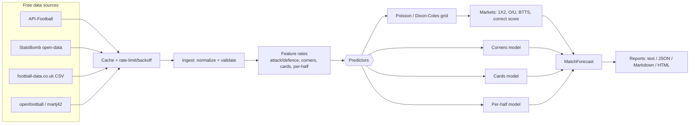

# soccer-prediction

Forecast soccer matches — with the **FIFA World Cup 2026** as the headline use case — from **free** historical stats. Given two teams, it predicts full-time and per-half scorelines, **total and minimum corners**, cards, both-teams-to-score, and over/under totals, and can render the result as text, JSON, Markdown, or a styled HTML report.

- Pure-Python core (no heavy runtime dependencies); optional `[accel]` extra for numpy/scipy/penaltyblog.
- Pluggable free data sources (API-Football, StatsBomb open-data, football-data.co.uk, openfootball) behind one `DataSource` contract.
- Interchangeable models (independent Poisson, Dixon-Coles) behind one `Predictor` contract, plus dedicated corner, card, and per-half models.
- Library API + `soccer-predict` CLI + runnable offline examples.

## Table of Contents

- [Overview](#overview)
- [System Architecture](#system-architecture)
- [Getting Started](#getting-started)
- [Quick Start](#quick-start)
- [Example: Switzerland vs Colombia](#example-switzerland-vs-colombia)
- [CLI Reference](#cli-reference)
- [Data Sources](#data-sources)
- [Prediction Models](#prediction-models)
- [Configuration](#configuration)
- [Testing and Quality Gates](#testing-and-quality-gates)
- [Version History](#version-history)
- [License](#license)

## Overview

Key features:

- ⚽ **Full-time result** (1X2), correct-score grid, over/under, and both-teams-to-score, all derived consistently from one scoreline distribution.
- ⏱️ **Per-half scoring** — separate first- and second-half models for "who scores in each half".
- 🚩 **Corners** — expected and total corners, over/under lines, and a **minimum** (10th-percentile) estimate per team.
- 🟨 **Cards** — yellow/red expectations, booking points, and over/under card lines.
- 🔌 **Free data** — swap data sources without touching the models; bundled offline samples for zero-setup demos.
- 🧪 **Trustworthy** — walk-forward backtesting with ranked-probability-score, log-loss, and Brier metrics.

## System Architecture



## Getting Started

Requires Python 3.11+.

```powershell
py -m venv .venv
.\.venv\Scripts\Activate.ps1
python -m pip install --upgrade pip
python -m pip install -e ".[dev]"
```

```bash
python3 -m venv .venv
. .venv/bin/activate
python -m pip install --upgrade pip
python -m pip install -e ".[dev]"
```

The heavy scientific stack is optional; install it only if you want to plug in numpy/scipy/penaltyblog-backed models:

```bash
python -m pip install -e ".[accel]"
```

## Quick Start

```python
from soccer_prediction import forecast_fixture

forecast = forecast_fixture("Brazil", "Argentina", source="bundled_wc2026")
print(forecast.result.selection, f"{forecast.result.probability:.1%}")
print("Total corners:", round(forecast.corners.total_expected, 2))
print("Minimum corners:", forecast.corners.home_minimum, "-", forecast.corners.away_minimum)
```

Run the bundled World Cup 2026 example:

```bash
python -m soccer_prediction
```

## Example: Switzerland vs Colombia

The `soccer_prediction.example` package ships offline, illustrative history for both national teams and forecasts the fixture end to end, writing an HTML and a Markdown report.

```python
from soccer_prediction.example import run_switzerland_colombia, write_reports, build_forecast

# Print a text forecast and write reports/switzerland_colombia.{html,md}
run_switzerland_colombia()

# Or get the typed forecast and inspect any market
forecast = build_forecast()
print(forecast.correct_score.home_draw_away())      # (home, draw, away)
print(forecast.corners.home_minimum, forecast.corners.away_minimum)
print(forecast.per_half.half_time_result)

# Write reports to a directory of your choice
paths = write_reports("my_reports")
print(paths["html"], paths["md"])
```

From a clean checkout (no install needed):

```bash
python -c "from soccer_prediction.example.switzerland_colombia_example import run_example; run_example()"
```

Or straight from the CLI, writing a styled HTML report:

```bash
soccer-predict predict --home Switzerland --away Colombia --source bundled_swi_col --format html --output reports/switzerland_colombia.html
```

The bundled history is illustrative sample data for offline demos. In production the same models run on real data pulled from the free sources below.

## CLI Reference

| Command | Purpose | Key options |
| --- | --- | --- |
| `soccer-predict predict` | Forecast a fixture | `--home`, `--away`, `--model` (`dixon_coles`/`poisson`), `--source` (`auto`/`bundled_wc2026`/`bundled_swi_col`/…), `--format` (`text`/`json`/`md`/`html`), `--output <file>` |
| `soccer-predict fetch` | Fetch team history (placeholder wiring) | `--team`, `--competition` |
| `soccer-predict backtest` | Backtest a model (placeholder wiring) | `--competition`, `--metric` |

Exit code `0` on success. Run `soccer-predict --help` for the full surface.

## Data Sources

All are free; see [docs/data-sources.md](docs/data-sources.md) for auth, coverage, and licensing detail.

| Source | Corners | Cards | Half-time | Coverage | Notes |
| --- | --- | --- | --- | --- | --- |
| API-Football | yes | yes | yes | leagues + World Cup 2026 | free key, 100 req/day |
| StatsBomb open-data | yes | yes | derivable | World Cup 2018/2022 | non-commercial + attribution |
| football-data.co.uk | yes | yes | yes | club leagues | no auth; rate priors |
| openfootball / martj42 | no | no | yes / no | World Cup + internationals | CC0 |

## Prediction Models

See [docs/models.md](docs/models.md). Goal markets come from a single scoreline distribution (independent Poisson, or Dixon-Coles with a low-score correction). Corners use a low-quantile "minimum" plus over/under tails; cards use a Poisson count model; per-half uses two independent half models.

## Configuration

Defaults live in `soccer_prediction/config/defaults.yaml` and are overridable by environment variables. Full table in [docs/api.md](docs/api.md).

| Variable | Purpose | Default |
| --- | --- | --- |
| `SOCCER_PREDICTION_API_FOOTBALL_KEY` | API-Football key (never hard-code it) | empty |
| `SOCCER_PREDICTION_CACHE_DIR` | On-disk cache directory | `.cache/soccer_prediction` |
| `SOCCER_PREDICTION_MODEL_MAX_GOALS` | Scoreline grid size | `8` |

## Testing and Quality Gates

```bash
python -m pytest --cov=soccer_prediction
python -m ruff check .
python -m ruff format --check .
python -m mypy soccer_prediction
python -m build
```

## Version History

| Version | Date | Changes |
| --- | --- | --- |
| 0.1.0 | 2026-07-07 | Initial release: free-data ingestion, Poisson/Dixon-Coles goals, corners (total + minimum), cards, per-half, backtesting, CLI, HTML/MD reports, offline examples. |

## License

MIT. See [LICENSE](LICENSE). Maintained by Arman Dabiri.
